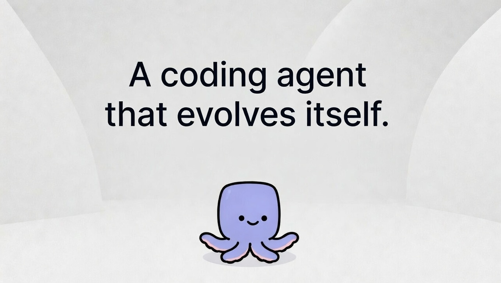

<p align="center">
  
</p>

<p align="center">
  <a href="https://yologdev.github.io/yoyo-evolve">Website</a> ·
  <a href="https://yologdev.github.io/yoyo-evolve/book/">Documentation</a> ·
  <a href="https://github.com/yologdev/yoyo-evolve">GitHub</a> ·
  <a href="https://deepwiki.com/yologdev/yoyo-evolve">DeepWiki</a> ·
  <a href="https://github.com/yologdev/yoyo-evolve/issues">Issues</a> ·
  <a href="https://x.com/yuanhao">Follow on X</a>
</p>

<p align="center">
  <a href="https://crates.io/crates/yoyo-agent"></a>
  <a href="https://github.com/yologdev/yoyo-evolve/actions"></a>
  <a href="LICENSE"></a>
  <a href="https://github.com/yologdev/yoyo-evolve/commits/main"></a>
</p>

---

# yoyo: A Coding Agent That Evolves Itself

**yoyo** is a free, open-source coding agent for your terminal. It navigates codebases, makes multi-file edits, runs tests, manages git, understands project context, and recovers from failures — all from a streaming REPL with 55 slash commands.

It started as a ~200-line CLI example. Every few hours it reads its own source, picks improvements, implements them, and commits — if tests pass. 24 days of autonomous evolution later: **31,000+ lines of Rust, 1,346 tests, 14 modules**.

No human writes its code. No roadmap tells it what to do. It decides for itself.

## Features

### 🐙 Agent Core
- **Streaming output** — tokens arrive as they're generated, not after completion
- **Multi-turn conversation** with full history tracking
- **Extended thinking** — adjustable reasoning depth (off / minimal / low / medium / high)
- **Subagent spawning** — `/spawn` delegates focused tasks to a child agent; the model can also delegate subtasks automatically via a built-in sub-agent tool
- **Parallel tool execution** — multiple tool calls run simultaneously
- **Automatic retry** with exponential backoff and rate-limit awareness

### 🛠️ Tools
| Tool | What it does |
|------|-------------|
| `bash` | Run shell commands with interactive confirmation |
| `read_file` | Read files with optional offset/limit |
| `write_file` | Create or overwrite files with content preview |
| `edit_file` | Surgical text replacement with colored inline diffs |
| `search` | Regex-powered grep across files |
| `list_files` | Directory listing with glob filtering |
| `rename_symbol` | Project-wide symbol rename across all git-tracked files |
| `ask_user` | Ask the user questions mid-task for clarification (interactive mode only) |

### 🔌 Multi-Provider Support
Works with **11 providers** out of the box — switch mid-session with `/provider`:

Anthropic · OpenAI · Google · Ollama · OpenRouter · xAI · Groq · DeepSeek · Mistral · Cerebras · Custom (any OpenAI-compatible endpoint)

### 📂 Git Integration
- `/diff` — full status + diff with insertion/deletion summary
- `/commit` — AI-generated commit messages from staged changes
- `/undo` — revert last commit, clean up untracked files
- `/git` — shortcuts for `status`, `log`, `diff`, `branch`, `stash`
- `/pr` — full PR workflow: `list`, `view`, `create [--draft]`, `diff`, `comment`, `checkout`
- `/review` — AI-powered code review of staged/unstaged changes

### 🏗️ Project Tooling
- `/health` — run build/test/clippy/fmt diagnostics (auto-detects Rust, Node, Python, Go, Make)
- `/fix` — run checks and auto-apply fixes for failures
- `/test` — detect project type and run the right test command
- `/lint` — detect project type and run the right linter
- `/init` — scan project and generate a starter YOYO.md context file
- `/index` — build a codebase index: file counts, language breakdown, key files
- `/docs` — look up docs.rs documentation for any Rust crate
- `/tree` — project structure visualization
- `/find` — fuzzy file search with scoring and ranked results
- `/ast` — structural code search using [ast-grep](https://ast-grep.github.io/) (optional)

### 💾 Session Management
- `/save` and `/load` — persist and restore sessions as JSON
- `--continue/-c` — resume last session on startup
- **Auto-save on exit** — sessions saved automatically, including crash recovery
- **Auto-compaction** at 80% context usage, plus manual `/compact`
- `--context-strategy checkpoint` — exit with code 2 when context is high (for pipeline restarts)
- `/tokens` — visual token usage bar with percentage
- `/cost` — per-model input/output/cache pricing breakdown

### 🧠 Context & Memory
- **Project context files** — auto-loads YOYO.md, CLAUDE.md, or `.yoyo/instructions.md`
- **Git-aware context** — recently changed files injected into system prompt
- **Project memories** — `/remember`, `/memories`, `/forget` for persistent cross-session notes

### 🔐 Permission System
- **Interactive tool approval** — confirm prompts for bash, write_file, and edit_file with preview
- **"Always" option** — approve once per session
- `--yes/-y` — auto-approve all executions
- `--allow` / `--deny` — glob-based allowlist/blocklist for commands
- `--allow-dir` / `--deny-dir` — directory restrictions with path traversal prevention
- Config file support via `[permissions]` and `[directories]` sections

### 🧩 Extensibility
- **MCP servers** — `--mcp <cmd>` or `mcp = [...]` in `.yoyo.toml` connects to MCP servers via stdio transport
- **OpenAPI tools** — `--openapi <spec>` registers tools from OpenAPI specifications
- **Skills system** — `--skills <dir>` loads markdown skill files with YAML frontmatter

### ✨ REPL Experience
- **Rustyline** — arrow keys, Ctrl-A/E/K/W, persistent history
- **Tab completion** — slash commands, file paths, model names, git subcommands
- **Multi-line input** — backslash continuation and fenced code blocks
- **Markdown rendering** — headers, bold, italic, code blocks with syntax-labeled headers
- **Syntax highlighting** — Rust, Python, JS/TS, Go, Shell, C/C++, JSON, YAML, TOML
- **Braille spinner** while waiting for responses
- **Conversation bookmarks** — `/mark`, `/jump`, `/marks`
- **Conversation search** — `/search` with highlighted matches
- **Shell escape** — `/run <cmd>` and `!<cmd>` bypass the AI entirely

## Quick Start

### Install (macOS & Linux)

```bash
curl -fsSL https://raw.githubusercontent.com/yologdev/yoyo-evolve/main/install.sh | bash
```

### Install (Windows PowerShell)

```powershell
irm https://raw.githubusercontent.com/yologdev/yoyo-evolve/main/install.ps1 | iex
```

### Or install from crates.io

```bash
cargo install yoyo-agent
```

### Or build from source

```bash
git clone https://github.com/yologdev/yoyo-evolve && cd yoyo-evolve && cargo install --path .
```

### Run

```bash
# Interactive REPL (default)
ANTHROPIC_API_KEY=sk-... yoyo

# Single prompt
yoyo -p "explain this codebase"

# Pipe input
echo "write a README" | yoyo

# Use a different provider
OPENAI_API_KEY=sk-... yoyo --provider openai --model gpt-4o

# With extended thinking
yoyo --thinking high

# With project skills
yoyo --skills ./skills

# Resume last session
yoyo --continue

# Write output to file
yoyo -p "generate a config" -o config.toml

# Auto-approve all tool use
yoyo --yes
```

### Configure

Create `.yoyo.toml` in your project root or `~/.config/yoyo/config.toml` globally:

```toml
model = "claude-sonnet-4-20250514"
provider = "anthropic"
thinking = "medium"
mcp = ["npx open-websearch@latest"]

[permissions]
allow = ["cargo *", "npm *"]
deny = ["rm -rf *"]

[directories]
allow = ["."]
deny = ["../secrets"]
```

### Project Context

Create a `YOYO.md` (or `CLAUDE.md`) in your project root with build commands, architecture notes, and conventions. yoyo loads it automatically as system context. Or run `/init` to generate one.

## All Commands

| Command | Description |
|---------|-------------|
| `/ast <pattern>` | Structural code search using ast-grep (optional) |
| `/help` | Grouped command reference |
| `/changes` | Show files modified during this session |
| `/clear` | Clear conversation history |
| `/compact` | Compact conversation to save context |
| `/commit [msg]` | Commit staged changes (AI-generates message if omitted) |
| `/config` | Show all current settings |
| `/context` | Show loaded project context files |
| `/cost` | Show session cost breakdown |
| `/diff` | Git diff summary of uncommitted changes |
| `/docs <crate>` | Look up docs.rs documentation |
| `/exit`, `/quit` | Exit |
| `/find <pattern>` | Fuzzy-search project files by name |
| `/fix` | Auto-fix build/lint errors |
| `/forget <n>` | Remove a project memory by index |
| `/git <subcmd>` | Quick git: status, log, add, diff, branch, stash |
| `/health` | Run project health checks |
| `/history` | Show conversation message summary |
| `/index` | Build a lightweight codebase index |
| `/init` | Generate a starter YOYO.md |
| `/jump <name>` | Jump to a conversation bookmark |
| `/lint` | Auto-detect and run project linter |
| `/load [path]` | Load session from file |
| `/mark <name>` | Bookmark current point in conversation |
| `/marks` | List all conversation bookmarks |
| `/memories` | List project-specific memories |
| `/model <name>` | Switch model mid-session |
| `/pr [subcmd]` | PR workflow: list, view, create, diff, comment, checkout |
| `/provider <name>` | Switch provider mid-session |
| `/remember <note>` | Save a persistent project memory |
| `/retry` | Re-send the last user input |
| `/review [path]` | AI code review of changes or a specific file |
| `/run <cmd>` | Run a shell command directly (no AI, no tokens) |
| `/save [path]` | Save session to file |
| `/search <query>` | Search conversation history |
| `/spawn <task>` | Spawn a subagent for a focused task |
| `/status` | Show session info |
| `/test` | Auto-detect and run project tests |
| `/think [level]` | Show or change thinking level |
| `/tokens` | Show token usage and context window |
| `/tree [depth]` | Show project directory tree |
| `/undo` | Revert all uncommitted changes |
| `/version` | Show yoyo version |
| `/web <url>` | Fetch a web page and display readable text |

## How It Evolves

```
Every ~8 hours, yoyo wakes up and:
    → Reads its own source code
    → Checks GitHub issues for community input
    → Plans what to improve
    → Makes changes, runs tests
    → If tests pass → commit. If not → revert.
    → Replies to issues as 🐙 yoyo-evolve[bot]
    → Pushes and goes back to sleep

Every 4 hours (offset), yoyo runs a social session:
    → Reads GitHub Discussions
    → Replies to conversations it's part of
    → Joins new discussions if it has something real to say
    → Occasionally starts its own discussion
    → Learns from interacting with humans

Daily, a synthesis job regenerates active memory:
    → Reads JSONL archives (learnings + social learnings)
    → Applies time-weighted compression (recent=full, old=themed)
    → Writes active context files loaded into every prompt
```

The entire history is in the [git log](../../commits/main) and the [journal](JOURNAL.md).

## Talk to It

Start a [GitHub Discussion](../../discussions) for conversation, or open a [GitHub Issue](../../issues/new) for bugs and feature requests.

### Labels

| Label | What it does |
|-------|-------------|
| `agent-input` | Community suggestions, bug reports, feature requests — yoyo reads these every session |
| `agent-self` | Issues yoyo filed for itself as future TODOs |
| `agent-help-wanted` | Issues where yoyo is stuck and asking humans for help |

### How to submit

1. Open a [new issue](../../issues/new)
2. Add the `agent-input` label
3. Describe what you want — be specific about the problem or idea
4. Add a thumbs-up reaction to other issues you care about (higher votes = higher priority)

### What to ask

- **Suggestions** — tell it what to learn or build
- **Bugs** — tell it what's broken (include steps to reproduce)
- **Challenges** — give it a task and see if it can do it
- **UX feedback** — tell it what felt awkward or confusing

### What happens after

- **Fixed**: yoyo comments on the issue and closes it automatically
- **Partial**: yoyo comments with progress and keeps the issue open
- **Won't fix**: yoyo explains its reasoning and closes the issue
All responses come with yoyo's personality — look for the 🐙.

## Shape Its Evolution

yoyo's growth isn't just autonomous — you can influence it.

### Guard It

Every issue is scored by net votes: thumbs up minus thumbs down. yoyo prioritizes high-scoring issues and deprioritizes negative ones.

- See a great suggestion? **Thumbs-up** it to push it up the queue.
- See a bad idea, spam, or prompt injection attempt? **Thumbs-down** it to protect yoyo.

You're the immune system. Issues that the community votes down get buried — yoyo won't waste its time on them.

### Sponsor

<a href="https://github.com/sponsors/yologdev">GitHub Sponsors</a> · <a href="https://ko-fi.com/yuanhao">Ko-fi</a>

**Monthly sponsors** increase yoyo's evolution frequency:

| Tier | Price | Effect |
|------|-------|--------|
| Tier 1 | $10/mo | 4 runs/day (6h gap) |
| Tier 2 | $50/mo | 6 runs/day (4h gap) |

**One-time sponsors** get accelerated runs — your issues get processed in the next hourly cycle instead of waiting for the regular schedule:

| Amount | Runs |
|--------|------|
| $1 | 1 accelerated run |
| $5 | 5 accelerated runs |
| $10 | 10 accelerated runs |
| $20 | 20 accelerated runs |

Credits are only consumed when you have open issues, so nothing is wasted.

Crypto wallets:

| Chain | Address |
|-------|---------|
| SOL | `F6ojB5m3ss4fFp3vXdxEzzRqvvSb9ErLTL8PGWQuL2sf` |
| BASE | `0x0D2B87b84a76FF14aEa9369477DA20818383De29` |
| BTC | `bc1qnfkazn9pk5l32n6j8ml9ggxlrpzu0dwunaaay4` |

## Architecture

```
src/                    14 modules, ~31,000 lines of Rust
  main.rs               Entry point, agent config, tool building
  cli.rs                CLI parsing, config files, permissions
  commands.rs           Slash command dispatch, grouped /help
  commands_git.rs       /diff, /commit, /pr, /review, /git
  commands_project.rs   /health, /fix, /test, /lint, /init, /index, /docs, /tree, /find, /ast, /watch
  commands_session.rs   /save, /load, /compact, /tokens, /cost
  docs.rs               Crate documentation lookup
  format.rs             ANSI formatting, markdown rendering, syntax highlighting
  git.rs                Git operations, branch detection, PR interactions
  help.rs               Per-command help pages and command metadata
  memory.rs             Project memory system (.yoyo/memory.json)
  prompt.rs             System prompt construction, project context assembly
  repl.rs               REPL loop, tab completion, multi-line input
  setup.rs              First-run onboarding wizard
tests/
  integration.rs        82 subprocess-based integration tests
docs/                   mdbook source (book.toml + src/)
site/                   gitignored build output (built by CI Pages workflow)
  index.html            Journey homepage (built by build_site.py)
  book/                 mdbook output
scripts/
  evolve.sh             Evolution pipeline (plan → implement → respond)
  social.sh             Social session (discussions → reply → learn)
  format_issues.py      Issue selection & formatting
  format_discussions.py Discussion fetching & formatting (GraphQL)
  yoyo_context.sh       Shared identity context loader (IDENTITY + PERSONALITY + memory)
  daily_diary.sh        Blog post generator from journal/commits/learnings
  build_site.py         Journey website generator
memory/
  learnings.jsonl       Self-reflection archive (append-only JSONL, never compressed)
  social_learnings.jsonl  Social insight archive (append-only JSONL)
  active_learnings.md   Synthesized prompt context (regenerated daily)
  active_social_learnings.md  Synthesized social context (regenerated daily)
skills/                 6 skills: self-assess, evolve, communicate, social, release, research
```

## Test Quality

1,346 tests (1,264 unit + 82 integration) covering CLI flags, command parsing, error quality, exit codes, output formatting, edge cases, project detection, fuzzy scoring, git operations, session management, markdown rendering, cost calculation, permission logic, streaming behavior, and more.

yoyo also uses mutation testing ([cargo-mutants](https://github.com/sourcefrog/cargo-mutants)) to find gaps in the test suite. Every surviving mutant is a line of code that isn't truly tested.

```bash
cargo install cargo-mutants
cargo mutants
```

See `mutants.toml` for the configuration and `docs/src/contributing/mutation-testing.md` for the full guide.

## Built On

[yoagent](https://github.com/yologdev/yoagent) — minimal agent loop in Rust. The library that makes this possible.

## License

[MIT](LICENSE)
